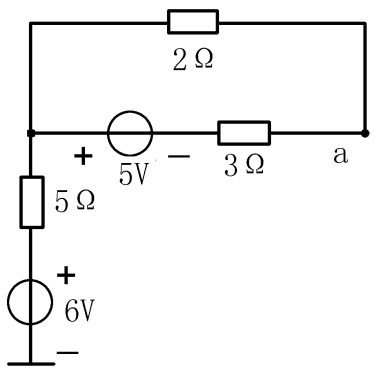
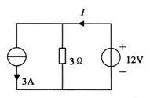
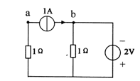
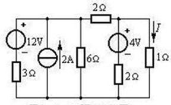
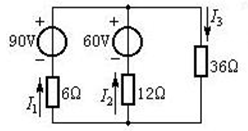
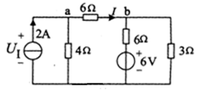

<button id="review-btn" onclick="toggleReviewMode()">🕶️ 背诵模式</button>

# 1.电工电子技术上课程期末试卷（A卷）

## 一、单项选择题（每小题2分，共40分）

1. 理想电流源的电流 ( **D** )
    - A. 与外接元件有关
    - B. 与参考点的选取有关
    - C. 与其两端电压有关
    - D. 与其两端电压无关

2. 输出电压总能保持定值，其值与流过它的电流无关的元件定义为 ( **D** )
    - A. 电容
    - B. 电感
    - C. 恒流源
    - D. 恒压源

3. 基尔霍夫电流定律KCL是线性约束 ( **A** )
    - A. 节点中的支路电流
    - B. 回路中的各个电压
    - C. 一段电路中的各个电压
    - D. 闭合面中的各条电流不受约束

4. 戴维宁定理表述为：任何一个线性含源一端口网络，对外电路来说，可以用来等效替代的组合是 ( **B** )
    - A. 一个电压源和一个电阻并联
    - B. 一个电压源和一个电阻串联
    - C. 一个电流源和一个电阻并联
    - D. 一个电流源和一个电阻串联

5. 储存电场能量的元件是 ( **C** )
    - A. 电阻
    - B. 电感
    - C. 电容
    - D. 蓄电池

6. 如图所示电路中，a点电位等于 ( **D** )

    { width="170" align=center}

    - A. 1V
    - B. 11V
    - C. 4V
    - D. 6V

7. 直流电路如图所示，电流I应等于 ( **A** )

    

    - A. 7A
    - B. 4A
    - C. 3A
    - D. 1A

8. 电路如图所示，Uab = ( **C** )

    

    - A. -1V
    - B. 0V
    - C. 1V
    - D. 2V

9. 实验室中的交流电压表和电流表，测量的是 ( **D** )
    - A. 瞬时值
    - B. 最大值
    - C. 平均值
    - D. 有效值

10. 当功率因数 $\cos\phi = 0.5$, $S = 100VA$，有功功率为 ( **B** )
    - A. 13.4W
    - B. 50W
    - C. 86.6W
    - D. 100W

11. 在R、L、C串联电路中，已知 $R=5\Omega$， $X_L=8\Omega$， $X_C=8\Omega$，则电路的性质 ( **C** )
     - A. 感性
     - B. 容性
     - C. 阻性 (发生串联谐振)
     - D. 不能确定

12. 正弦电压 $u(t)=2\sin(314t-45^\circ)V$，有效值相量表示为 ( **D** )
     - A. $2\angle-45^\circ V$
     - B. $\angle45^\circ V$
     - C. $2\angle45^\circ V$
     - D. $\sqrt{2}\angle-45^\circ V$ (注：最大值为2，有效值为 $\sqrt{2}$)

13. 某对称星形三相电路中，线电压为380V，线电流为5A，各线电压分别与对应线电流同相位，则三相总功率P为 ( **A** )
     - A. 3300W ($P=\sqrt{3} \times 380 \times 5 \times 1 \approx 3290$)
     - B. 2850W
     - C. 1900W
     - D. 1100W

14. 已知某元件 $Z=10-j4(\Omega)$，则可判断该元件为 ( **C** )
     - A. 电阻性
     - B. 电感性
     - C. 电容性 (虚部为负)
     - D. 不能确定

15. 在供电系统中，当电源电压及负载的有功功率一定时，提高电路的功率因数，可使供电线路的功率损耗 ( **B** )
     - A. 增大
     - B. 减小
     - C. 不变
     - D. 不能确定

16. 三相四线制电路中，已知三相电流是对称的，并且 $I_A=10A, I_B=10A, I_C=10A$，则中线电流为 ( **C** )
     - A. 10A
     - B. 5A
     - C. 0A
     - D. 30A

17. 匝数比 K=20 的变压器接在 220V 的市电电源上，则副边线圈两端的电压为 ( **A** )
     - A. 11V
     - B. 220V
     - C. 380V
     - D. 4400V

18. 在负载为三角形连接的对称三相电路中，各线电流与相电流的关系是 ( **D** )
     - A. 大小、相位都相等
     - B. 大小相等、线电流超前相应的相电流
     - C. 线电流大小为相电流大小的 $\sqrt{3}$ 倍、线电流超前相应的相电流
     - D. 线电流大小为相电流大小的 $\sqrt{3}$ 倍、线电流滞后相应的相电流

19. 有功功率 P、无功功率 Q 与视在功率 S 之间，正确的关系式是 ( **D** )
     - A. $S=P-Q$
     - B. $S=P+Q$
     - C. $S=P^2+Q^2$
     - D. $S=\sqrt{P^2+Q^2}$

20. 一台三相异步电动机的磁极对数 p=2，电源频率为 50Hz，电动机转速 n=1440r/min，其中转差率 s 为 ( **B** )
     - A. 1%
     - B. 4% ($n_0=1500, s=(1500-1440)/1500=0.04$)
     - C. 3%
     - D. 2%

---

## 二、计算题（每小题10分，共60分）

1.（10分）试用电源等效变换的方法，求如图所示电路中的电流 I。

{ width="300" }

> **解题思路与参考答案：**
>
> **1. 左侧变换：12V电压源与 $3\Omega$ 电阻串联，等效为 4A（向上） 电流源并联 $3\Omega$ 电阻。**
> **2. 合并电流源：左侧 4A 源与中间 2A 源合并，总电流为 6A（向上）。**
> **3. 合并电阻：$3\Omega$ 电阻与 $6\Omega$ 电阻并联，等效电阻 $R = \frac{3 \times 6}{3+6} = 2\Omega$。**
> **4. 变换回电压源：6A 电流源并联 $2\Omega$ 电阻，等效为 12V电压源（正极在上）串联 $2\Omega$ 电阻。**
> **5. 串联整理：左侧回路总电阻为 $2\Omega + 2\Omega (\text{水平}) = 4\Omega$。**
> **6. 此时电路简化为两个节点：**
> **- 左支路：12V 源串联 $4\Omega$ 电阻。**
> **- 中支路（原图右侧部分）：4V 源串联 $2\Omega$ 电阻。**
> **- 右支路：$1\Omega$ 电阻（待求支路）。**
> **7. 计算结果：利用节点电压法可求得节点电压约为 2.86V。**
>
> **答：电流 I 约为 2.86A。**

 

2.（10分）电路如图所示，试应用叠加原理，求电路中的电流 $I_1$、 $I_2$ 及 $36\Omega$ 电阻消耗的电功率 P。

{ width="300" }

> **解题思路与参考答案：**
>
> **1. 当 90V 源单独作用时（60V 源短路）：**
> **- 总电流 $I_1' = 6A$ （方向向上）。**
> **- 分流计算：$I_2' = -4.5A$（题目定义方向向上，实际向下）。**
> **- 流过 $36\Omega$ 的电流 $I_{36}' = 1.5A$（方向向下）。**
>
> **2. 当 60V 源单独作用时（90V 源短路）：**
> **- 总电流 $I_2'' = 3.5A$（方向向上）。**
> **- 分流计算：$I_1'' = -3A$。**
> **- 流过 $36\Omega$ 的电流 $I_{36}'' = 0.5A$（方向向下）。**
>
> **3. 叠加计算：**
> **- $I_1 = I_1' + I_1'' = 6 - 3 = 3A$。**
> **- $I_2 = I_2' + I_2'' = -4.5 + 3.5 = -1A$。**
> **- 流过 $36\Omega$ 的总电流 $I_{36} = 1.5 + 0.5 = 2A$。**
> **- 功率 $P = I_{36}^2 \times R = 2^2 \times 36 = 144W$。**
>
> **答：$I_1=$ 3A, $I_2=$ -1A, $P=$ 144W。**

 

3.（10分）电路如图所示，要求：
(1) 用戴维南定理求 ab 支路中的电流 I（要画出戴维南等效电路）；
(2) 求理想电流源两端电压 $U_I$。

{ width="300" }

> **解题思路与参考答案：**
>
> **1. 求戴维南等效电路（断开 ab 支路）：**
> **- 开路电压 $U_{oc}$：**
> **- 左侧回路：$V_a = 2 \times 4 = 8V$。**
> **- 右侧回路：$V_b = 2V$。**
> **- $U_{oc} = V_a - V_b = 6V$。**
> **- 等效电阻 $R_{eq}$：**
> **- 电流源开路，电压源短路。**
> **- $R_{eq} = 4 + (6 || 3) = 4 + 2 = 6\Omega$。**
> **- 计算电流 I：**
> **- $I = \frac{U_{oc}}{R_{eq} + R_{load}} = \frac{6}{6+6} = 0.5A$。**
>
> **2. 求电流源电压 $U_I$：**
> **- 对节点 a 列 KCL：$I_{4\Omega} = 2 - 0.5 = 1.5A$。**
> **- $U_I = V_a = I_{4\Omega} \times 4 = 6V$。**
>
> **答：(1) I = 0.5A; (2) $U_I =$ 6V。**

 

4.（10分）日光灯电路计算
今有一个 40W 的日光灯，使用时灯管与镇流器 (可近似把镇流器看作纯电感) 串联在电压为 220V，频率为 50Hz 的电源上。已知灯管工作时属于纯电阻负载，灯管两端的电压等于 110V。
试求： 镇流器上的感抗和电感。这时电路的功率因数等于多少？

> **解题思路与参考答案：**
>
> **- 已知：$P=40W, U=220V, f=50Hz, U_R=110V$。**
> **- 电压关系：$U^2 = U_R^2 + U_L^2 \Rightarrow U_L = \sqrt{220^2 - 110^2} \approx 190.5V$。**
> **- 电路电流：$I = \frac{P}{U_R} = \frac{40}{110} \approx 0.364A$。**
> **- 镇流器感抗：$X_L = \frac{U_L}{I} = \frac{190.5}{0.364} \approx 523\Omega$。**
> **- 电感量：$L = \frac{X_L}{2\pi f} = \frac{523}{314} \approx 1.67H$。**
> **- 功率因数：$\cos\phi = \frac{U_R}{U} = \frac{110}{220} = 0.5$。**
>
> **答：感抗约 523Ω，电感约 1.67H，功率因数为 0.5。**

 

5.（10分）三相电路计算
对称三相电源，线电压 $U_L=380V$，对称三相感性负载作星形连接，若测得线电流 $I_L=17.3A$，三相功率 $P=9.12KW$。
求： 每相负载的电阻和感抗。

> **解题思路与参考答案：**
>
> **- 星形连接：$U_P = \frac{380}{\sqrt{3}} \approx 220V$，相电流 $I_P = I_L = 17.3A$。**
> **- 视在功率：$S = \sqrt{3} U_L I_L \approx 11385VA$。**
> **- 功率因数：$\cos\phi = \frac{P}{S} = \frac{9120}{11385} \approx 0.8$。**
> **- 阻抗模：$Z = \frac{U_P}{I_P} \approx 12.7\Omega$。**
> **- 电阻：$R = Z \cos\phi = 12.7 \times 0.8 \approx 10.16\Omega$。**
> **- 感抗：$X_L = Z \sin\phi = 12.7 \times 0.6 \approx 7.62\Omega$。**
>
> **答：每相电阻约 10.16Ω，感抗约 7.62Ω。**

 

6.（10分）电机计算
一台 Y225M-4 型的三相异步电动机，定子绕组 $\Delta$ 型联结，其额定数据为：
$P_N=11kW$，$n_N=1480r/min$，$U_N=380V$，$\eta_N=92.3\%$，$\cos\phi_N=0.88$，$I_{st}/I_N=7.0$，$T_{st}/T_N=1.9$，$T_{max}/T_N=2.2$。
求： (1) 额定电流 $I_N$？ (2) 额定转差率 $s_N$？ (3) 额定转矩 $T_N$、最大转矩 $T_{max}$ 和起动转矩 $T_{st}$。

> **解题思路与参考答案：**
>
> **1. 额定电流 $I_N$**
> **- 输入功率 $P_{in} = \frac{P_N}{\eta} \approx 11917W$。**
> **- $I_N = \frac{P_{in}}{\sqrt{3} U_N \cos\phi} = \frac{11917}{1.732 \times 380 \times 0.88} \approx 20.6A$。**
>
> **2. 额定转差率 $s_N$**
> **- 同步转速 $n_s = \frac{60f}{p} = \frac{3000}{2} = 1500r/min$。**
> **- $s_N = \frac{1500 - 1480}{1500} \approx 0.0133$。**
>
> **3. 转矩计算**
> **- 额定转矩 $T_N = 9550 \frac{P_N}{n_N} = 9550 \times \frac{11}{1480} \approx 71 N\cdot m$。**
> **- 最大转矩 $T_{max} = 2.2 T_N \approx 156.2 N\cdot m$。**
> **- 起动转矩 $T_{st} = 1.9 T_N \approx 134.9 N\cdot m$。**
>
> **答：(1) 20.6A; (2) 0.0133; (3) 71, 156.2, 134.9 $N\cdot m$。**
 

