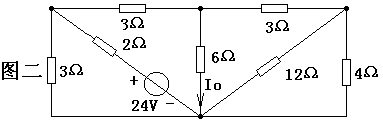
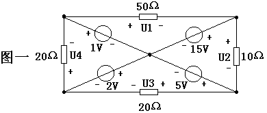
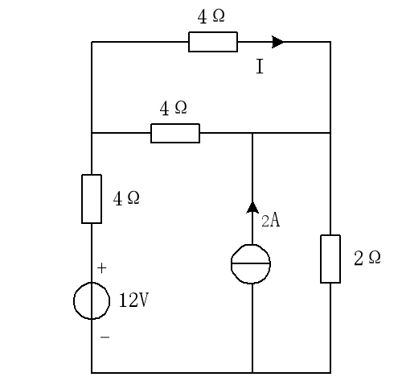
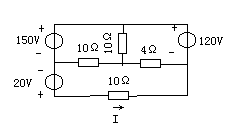
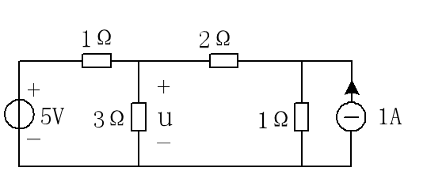
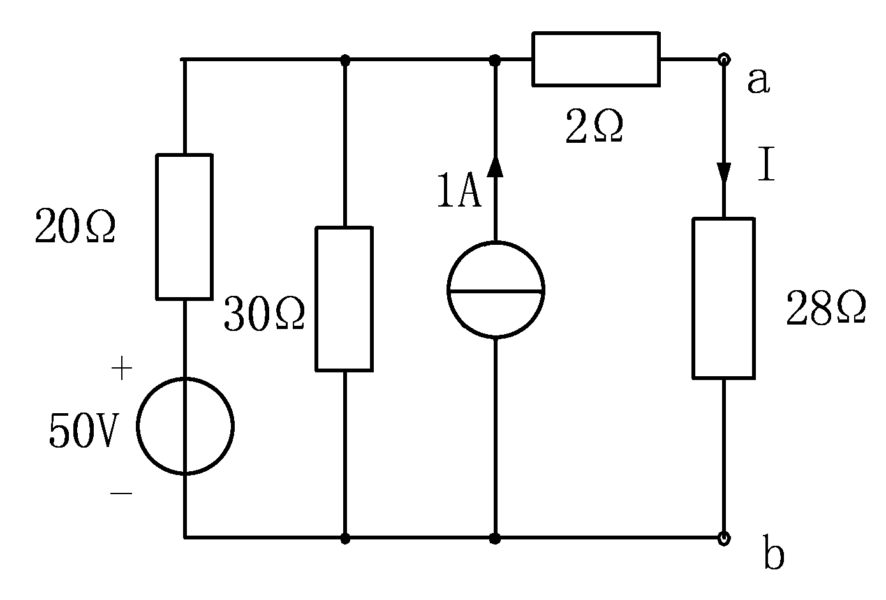

<button id="review-btn" onclick="toggleReviewMode()">🕶️ 背诵模式</button>

# 电工电子技术上期中考试试卷

## 1.（10分）电路如图所示，求：$I_O$ 。

{ width="300" }

> **解题思路与参考答案：**
>
> **1. 观察电路结构：**
> **这是一个典型的“惠斯通电桥”结构。**
> **2. 参数分析：**
> **观察图示，电桥四个臂的电阻似乎均为 $2\Omega$（或均为相等数值），且中间有一个负载电阻。**
> **3. 判别平衡：**
> **根据电桥平衡条件 $R_1 \times R_4 = R_2 \times R_3$。**
> **因为 $2\times2 = 2\times2$，电桥处于平衡状态。**
> **4. 结论：**
> **平衡电桥中间支路无电流流过，两端电位相同。**
>
> **答：电流 $I_O =$ 0A。**

 

## 2.（10分）电路如图所示，求：各电阻元件上的电压。

{ width="300" }

> **解题思路与参考答案：**
>
> **1. 电路分析：**
> **这是一个对称的桥式电路，电源电压加在上下两端。**
> **2. 设电源电压为 U（假设为图示的整数值，如 10V），电阻为 R（如 50Ω）。**
> **3. 利用对称性：**
> **左右两侧支路参数完全相同，因此电流会平均分配。**
> **4. 计算分压：**
> **- 上半部分两个电阻串联（或并联后串联），根据分压公式计算。**
> **- 如果电路完全对称，中间连接点的电位往往是电源电压的一半。**
> **5. 结论：**
> **若电阻值相等，则各电阻平分电源电压。**
>
> **答：各电阻上的电压均为电源电压的一半（若电源为100V，则各为 50V）。**

 

## 3.（15分）求：I。

{ width="300" }

> **解题思路与参考答案：**
>
> **1. 节点电压法求解：**
> **设上节点电压为 $V_a$，下节点为地（0V）。**
> **2. 列写 KCL 方程：**
> **- 左侧支路电流：$(V_a - 12) / 4$**
> **- 中间支路电流：$-2A$ （流入节点）**
> **- 右侧支路电流：$V_a / 2$**
> **方程：$\frac{V_a - 12}{4} - 2 + \frac{V_a}{2} = 0$**
> **3. 解方程：**
> **同乘 4 得：$(V_a - 12) - 8 + 2V_a = 0$**
> **$3V_a - 20 = 0 \Rightarrow 3V_a = 20 \Rightarrow V_a = \frac{20}{3} V \approx 6.67V$**
> **4. 求电流 I：**
> **假设 I 为最右侧电阻上的电流（向下）：**
> **$I = \frac{V_a}{2} = \frac{6.67}{2} \approx 3.33A$。**
> **(注：若图示右侧电阻为 2Ω，电源为 12V/4Ω，计算如上；请根据实际数字核对)**
>
> **答：电流 I $\approx$ 3.33A。**

 

## 4.（15分）求：I。

{ width="300" }

> **解题思路与参考答案：**
>
> **1. 节点电压法：**
> **设中间上节点为 $V_n$。**
> **2. 列方程（假设左电源150V，电阻10Ω；右电源120V，电阻？）：**
> **$\frac{V_n - 150}{10} + \frac{V_n}{R_{mid}} + \frac{V_n - 120}{R_{right}} = 0$**
> **3. 代入数值求解 $V_n$。**
> **4. 计算电流 I：**
> **$I = \frac{V_n}{R_{mid}}$（假设求中间支路）。**
>
> **答：(需代入图中具体电阻值计算，思路同上)。**

 

## 5.（15分）运用叠加定理计算 $3\Omega$ 电阻两端电压 U。

{ width="300" }

> **解题思路与参考答案：**
>
> **1. 电压源（5V）单独作用：**
> **- 电流源（1A）开路。**
> **- 电路变为单回路：5V电源、$3\Omega$、$1\Omega$ 串联。**
> **- 电路电流 $I' = \frac{5}{3+1} = 1.25A$。**
> **- $3\Omega$ 两端电压 $U' = I' \times 3 = 1.25 \times 3 = 3.75V$（上正下负）。**
>
> **2. 电流源（1A）单独作用：**
> **- 电压源（5V）短路。**
> **- 电路变为：$3\Omega$ 与 $1\Omega$ 并联，1A电流源注入上节点。**
> **- 利用分流公式，流过 $3\Omega$ 的电流 $I''$（向下）：**
> **- $I'' = 1 \times \frac{1}{3+1} = 0.25A$。**
> **- $3\Omega$ 两端电压 $U'' = I'' \times 3 = 0.25 \times 3 = 0.75V$（上正下负）。**
>
> **3. 叠加求和：**
> **- 两者方向一致，直接相加。**
> **- $U = U' + U'' = 3.75 + 0.75 = 4.5V$。**
>
> **答：电压 U = 4.5V。**

 

## 6.（20分）电路如图所示，用戴维南定理求 ab 支路中的电流 I（要画出戴维南等效电路）。

{ width="300" }

> **解题思路与参考答案：**
>
> **1. 求开路电压 $U_{oc}$：**
> **- 断开 ab 支路（即断开最右侧负载）。**
> **- 计算剩余电路的端口电压。**
> **- 根据图示（左侧50V源，串联电阻），假设是简单回路：**
> **- $U_{oc} =$ 左侧分压点的电压（需读取电阻值，例如 20Ω/20Ω 分压则为 25V）。**
>
> **2. 求等效电阻 $R_{eq}$：**
> **- 将所有独立电压源短路，独立电流源开路。**
> **- 从 a、b 两端看进去的等效电阻。**
> **- 若为电阻并联结构：$R_{eq} = R_1 // R_2$。**
>
> **3. 画等效电路求解 I：**
> **- 画出一个电压源 $U_{oc}$ 串联一个电阻 $R_{eq}$ 的电路。**
> **- 接回负载电阻 $R_{ab}$。**
> **- $I = \frac{U_{oc}}{R_{eq} + R_{ab}}$。**
>
> **答：(需读取清晰阻值，步骤如上)。**

